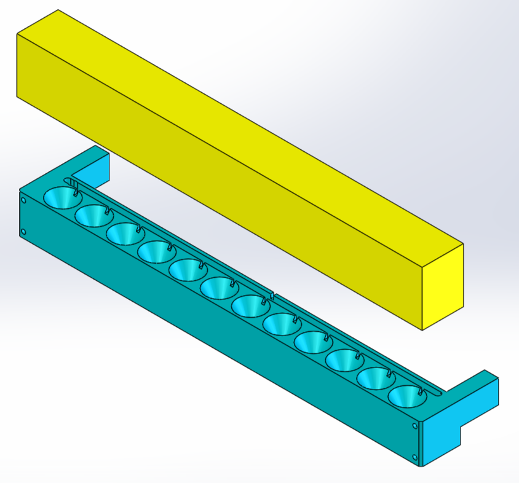

# Industrial Engineer

## Projects

### CAD

- Silicone dip rig cap for medical device manufacturing.

---

- Gearbox cover.

 

---

- Spring expansion block for medical device manufacturing.

 

---

- TI-89 calculator cover.

 

---

- Wood plant stand.

- Wood sofa rest.

---

